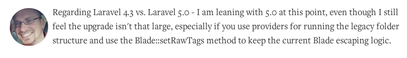
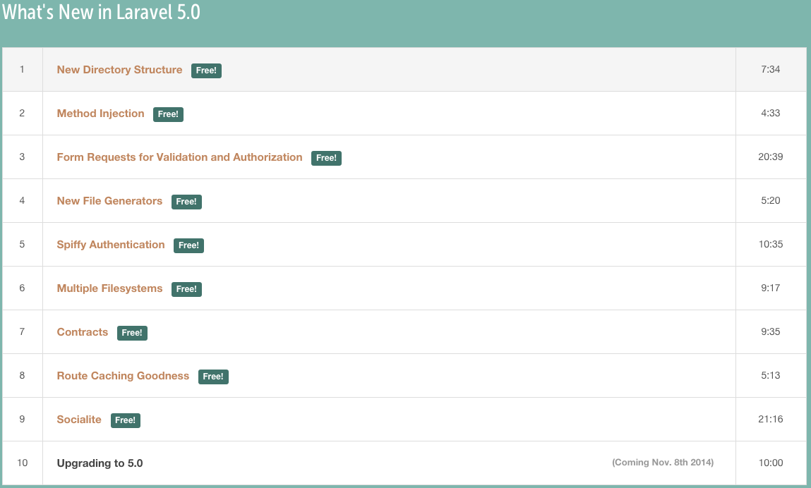
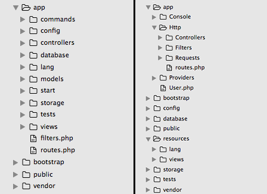
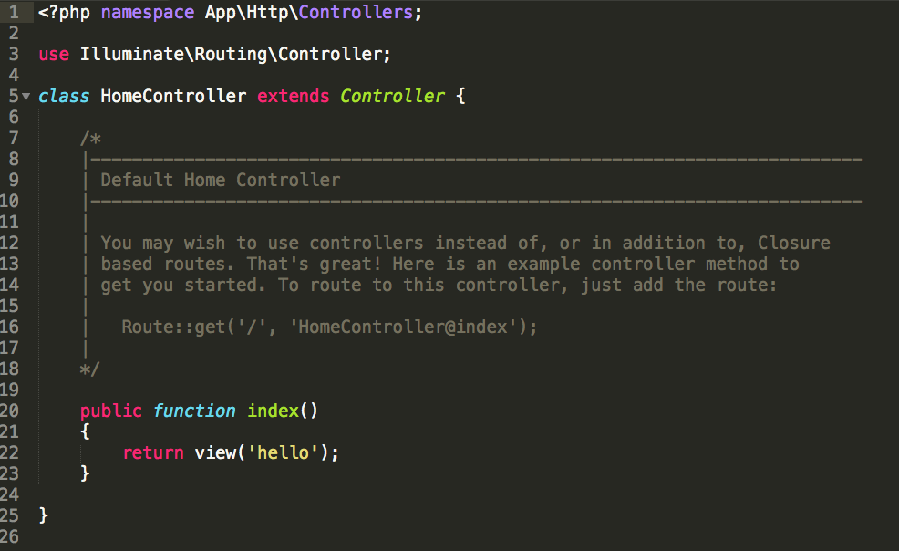
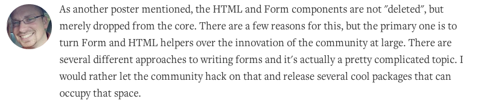
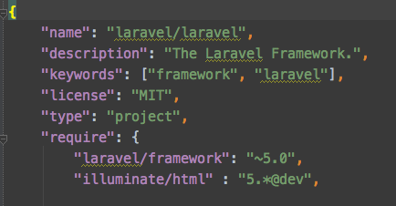

## 關於 Laravel ~~4.3~~ 5 ， Taylor 大神說

--<n>--

## 「其實我覺得沒有改很大」

 <!-- .element: style="width: 200%" -->

--<n>--

## 嗯......

 <!-- .element: style="width: 80%" -->

--<n>--

## 首先是重點中的重點

--<n>--

## Laracast : [What's New in Laravel 5.0](https://laracasts.com/series/whats-new-in-laravel-5)

 <!-- .element: style="width: 200%" -->

--<n>--

## 好，講完了


--<n>--

<!-- .slide: data-background="assets/img/polygon_red.jpg" class="bg-inverse" data-background-transition="zoom" data-transition="fade"-->

- 從 4.2 到 5 <!-- .element: style="font-size: 2em" -->
- 新玩意 <!-- .element: style="font-size: 2em" -->
- 升級 <!-- .element: style="font-size: 2em" -->

--<n>--

## 試玩版

 
``` 
$ composer create-project laravel/laravel {project_name} dev-develop --prefer-dist

```

--<n>--

## Directory Structure

  <!-- .element: style="width: 80%" -->

--<n>--

## Directory Structure

```
    app/commandd    => app/Console
    app/controllers => app/HTTP/Controllers

    app/models      => app/User.php ??
    app/start       => X

    app/lang        => resources/lang
    app/views       => resources/views

    config, database, tests, storage => root
```

--<n>--

## Directory Structure

- [Mattstauffer : Laravel 5.0 - Directory structure and namespace](http://mattstauffer.co/blog/laravel-5.0-directory-structure-and-namespace)
- [Laracast : New Directory Structure](https://laracasts.com/series/whats-new-in-laravel-5/episodes/1)

--<n>--

## Namespace
### app/Http/HomeController.php <!-- .element: style="text-align: center" -->

  <!-- .element: style="width: 80%" -->

--<n>--

## Namespace
### PSR-4 <!-- .element: style="text-align: center" -->

```
	//composer.json 

	"require": {
		"laravel/framework": "4.3.*"
	},
	"require-dev": {
		"phpunit/phpunit": "~4.0"
	},
	"autoload": {
		"classmap": [
			"database",
			"tests/TestCase.php"
		],
		"psr-4": {
			"App\\": "app/"
		}
	},
```

--<n>--

## Change Namespace

```
$ php artisan app:name YourNamespace
```

--<n>--

## Form & HTML 

```
{!!
	Form::text('username');
!!}
```

--<n>--

## It's Gone

 <!-- .element: style="width: 200%" -->

--<n>--

## Form & HTML 

 <!-- .element: style="width: 200%" -->

--<n>--

## Form & HTML 

"illuminate/html" : "5.*@dev"

 <!-- .element: style="width: 60%" -->

--<n>--

## Form & HTML

config/app.php <!-- .element: style="font-size: 1.5em; margin-bottom:20px" -->

```
'providers' => [
	...

	'Illuminate\Html\HtmlServiceProvider',
]

'aliases' => [
	...

    'HTML'      => 'Illuminate\Html\HtmlFacade',
    'Form'      => 'Illuminate\Html\FormFacade',
]
```

--<n>--

# Easy!!!

 <!-- .element: style="width: 200%" -->

--<n>--

## Blade Raw Tags

```
{{
	Form::text('username');
}}
```
---

Output escape html

`<input type="text" name="username">`

--<n>--

## Blade Raw Tags

```
{!!
	Form::text('username');
!!}
```
or

```
Blade::setRawTags( '{{' , '}}' );
```
