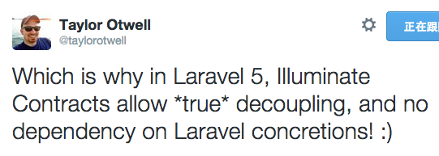
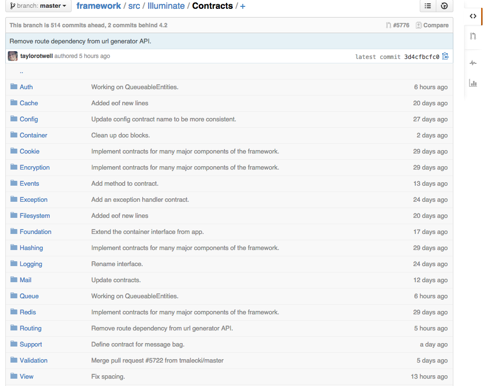
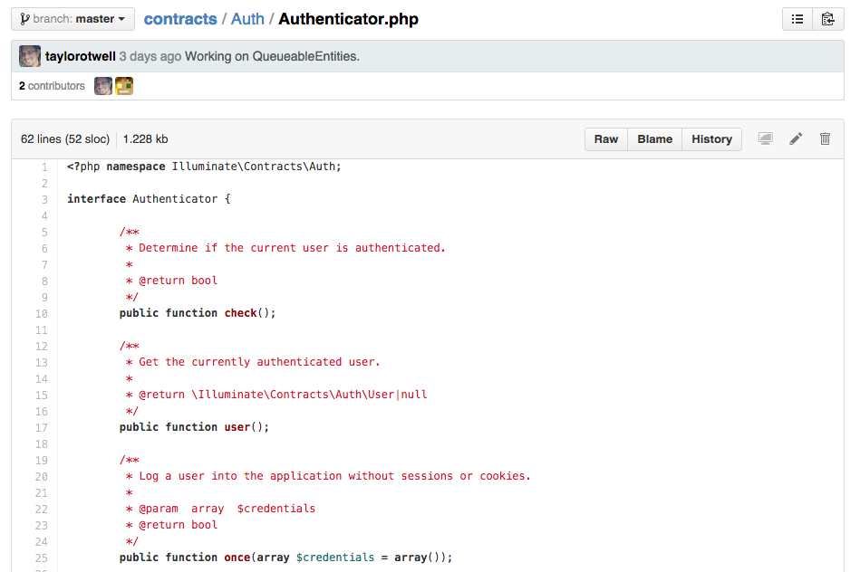
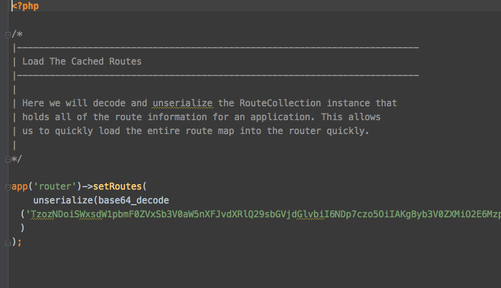

<!-- .slide: data-background="assets/img/light.jpg" class="bg-inverse" data-background-transition="zoom" data-transition="fade"-->

# 新玩意

- New Helpers
- Method Injection
- Form Request
- FileSystem - Flysystem
- Contract
- Route Cache
- Socilate

--<n>--


<!-- .slide: data-background="assets/img/jet-sky.jpg" class="bg-inverse" data-background-transition="linear" data-transition="fade"-->

# Helpers

--<n>--

## Helpers

- `view()` ---------- View::make()
- `redirect()` --- Redirect::to()
- `config()` ------- Config::get()
- `get()`  ------------- Route::get()
- `delete(), put(), post(), patch()`

--<n>--

## Helpers
###  Illuminate\Foundation\helpers.php <!-- .element: style="text-align:center" -->

```php

if ( ! function_exists('view'))
{
	/**
	 * Get the evaluated view contents for the given view.
	 *
	 * @param  string  $view
	 * @param  array   $data
	 * @param  array   $mergeData
	 * @return \Illuminate\View\View
	 */
	function view($view, $data = array(), $mergeData = array())
	{
		return app('view')->make($view, $data, $mergeData);
	}
}

```

--<n>--

<!-- .slide: data-background="assets/img/method_injection.jpg" class="bg-inverse" data-transition="fade" -->

# Method Injection

--<n>--

## Method Injection
### Before : Inject Dependency to Controller <!-- .element: style="text-align:center" -->

```php

namespace Backend\Http\Controllers;
use Backend\Repo\UserRepoInterface;

class HomeController extends BaseController {

    public function __construct(UserRepoInterface $repo) {
        $this->repo = $repo;
    }

	public function index() {
        $user = $this->repo->find(1);
		// ...
		return view('home.home');
	}
}

```

--<n>--

## Method Injection
### Laravel 5 : Inject Dependency to Method !! <!-- .element: style="text-align:center" -->

```php

namespace Backend\Http\Controllers;
use Backend\Repo\UserRepoInterface;

class HomeController extends BaseController {

	public function index(UserRepoInterface $repo) {
        $user = $repo->find(1);
		// ...
		return view('home.home');
	}
}

```

--<n>--

 <!-- .element: style="width: 200%" -->

--<n>--

## Method Injection

[Laracast - Method Injection](https://laracasts.com/series/whats-new-in-laravel-5/episodes/2) <!-- .element: style="font-size: 1.5em" --> 

--<n>--

<!-- .slide: data-background="assets/img/form_request.jpg" class="bg-inverse" data-transition="fade" -->

# Form Request

--<n>--

## Form Request
### Create a "CreateUserRequest" <!-- .element: style="text-align: center" -->

```
php artisan make:request CreateUserRequest
```

--<n>--

## Form Request
### app/Http/Requests/CreateUserRequest <!-- .element: style="text-align: center" -->

```php
class CreateUserRequest extends FormRequest {

	/**
	 * Get the validation rules that apply to the request.
	 *
	 * @return array
	 */
	public function rules()
	{
		return [
			//
		];
	}

	/**
	 * Determine if the user is authorized to make this request.
	 *
	 * @return bool
	 */
	public function authorize()
	{
		return false;
	}

}
```

--<n>--

## Form Request
### Then Inject to Controller Method <!-- .element: style="text-align: center" -->

```php
// CommentController

public function postComment(CommentFormRequest $request)
{
	
	// $request 可以使用 Input 的方法如 only() 、 all() ， 或使用 __get() 魔術方法
	$this->comment->create(
		$request->email,
		$request->comment
	);

    return Response::to('HomeController@index');
}
```

--<n>--

如果在方法裡注入了 FormRequest，就會自動執行驗證 <!-- .element: style="font-size: 1.5em" -->


驗證成功才會執行裡面的方法。 <!-- .element: style="font-size: 1.5em" -->

--<n>--

### What ? <!-- .element: style="text-align: center" -->

 <!-- .element: style="width: 200%" -->

--<n>--

## Form Request

### How it works <!-- .element: style="text-align: center" -->

- `Illuminate\Foundation\Providers\FormRequestServiceProvider` 註冊 `router.matched` 事件，解析時，如果( `resolvingAny` )有解析到 FormRequest 就會進行 initialize。
- `Illuminate\Validation\ValidationServiceProvider` ， `registerValiationResolverHook` hook `afterResolvingAny` ，當解析到 `ValidatesWhenResolved` 實例時會觸發 validate 方法。
- `Illuminate\Validation\ValidatesWhenResolvedTrait` 定義了 FormRequest 預設的 validate ，若驗證失敗會拋出例外
- `Illuminate/Foundation/Http/FormRequest` 預設 validate fail response

--<n>--

## Form Request

### Illuminate\Foundation\Providers\FormRequestServiceProvider <!-- .element: style="text-align: center" -->

註冊 `router.matched` 事件，解析時，如果( `resolvingAny` )有解析到 FormRequest 就會進行 initialize。

```
public function boot()
{
	$this->app['events']->listen('router.matched', function()
	{
		$this->app->resolvingAny(function($resolved, $app)
		{
			// If the resolved instance is an instance of the FormRequest object, we will go
			// ahead and initialize the request as well as set a few dependencies on this
			// request instance. The "ValidatesWhenResolved" hook will fire "validate".
			if ($resolved instanceof FormRequest)
			{
				$this->initializeRequest($resolved, $app['request']);

				$resolved->setContainer($app)
                         ->setRoute($app['Illuminate\Routing\Route'])
                         ->setRedirector($app['Illuminate\Routing\Redirector']);
			}
		});
	});
}
```

--<n>--

## Form Request

### Illuminate\Validation\ValidationServiceProvider <!-- .element: style="text-align: center" -->

`registerValiationResolverHook` hook `afterResolvingAny` ，當解析到 `ValidatesWhenResolved` 實例時會觸發 validate 方法。

```
/**
 * Register the "ValidatesWhenResolved" container hook.
 *
 * @return void
 */
protected function registerValiationResolverHook()
{
	$this->app->afterResolvingAny(function($resolved)
	{
		if ($resolved instanceof ValidatesWhenResolved)
		{
			$resolved->validate();
		}
	});
}
```	

--<n>--

## Form Request

### Illuminate\Validation\ValidatesWhenResolvedTrait <!-- .element: style="text-align: center" -->

定義了 FormRequest 預設的 validate

```php
	public function validate()
	{
		$instance = $this->getValidatorInstance();

		if ( ! $instance->passes())
		{
			$this->failedValidation($instance);
		}
		elseif ( ! $this->passesAuthorization())
		{
			$this->failedAuthorization();
		}
	}
```

--<n>--

## Form Request

### Illuminate\Validation\ValidatesWhenResolvedTrait <!-- .element: style="text-align: center" -->

validation fail 或 authorization fail ，拋出例外

```php
/**
 * Handle a failed validation attempt.
 */
protected function failedValidation(Validator $validator)
{
	throw new ValidationException($validator);
}

/**
 * Handle a failed authorization attempt.
 */
protected function failedAuthorization()
{
	throw new UnauthorizedException;
}
```

--<n>--

## Form Request

### Illuminate/Foundation/Http/FormRequest <!-- .element: style="text-align: center" -->

當捕捉到 ValidationException

```php
public function response(array $errors)
{
	if ($this->ajax())
	{
		return new JsonResponse($errors, 422);
	}
	else
	{
		return $this->redirector->to($this->getRedirectUrl())
                    					->withInput($this->except($this->dontFlash))
                                        ->withErrors($errors);
	}
}

```

--<n>--

## Form Request

- [Mattstauffer : Laravel 5.0 - Form Requests](http://mattstauffer.co/blog/laravel-5.0-form-requests)
- [Laracast : Form Requests for Validation and Authorization](https://laracasts.com/series/whats-new-in-laravel-5/episodes/3) - 20:39 (有一小段是舊的)
- [GitHub : Illuminate/Foundation/Http/FormRequest.php](https://github.com/laravel/framework/blob/master/src/Illuminate/Foundation/Http/FormRequest.php)

--<n>--

<!-- .slide: data-background="assets/img/fly_system.jpg" class="bg-inverse" data-transition="fade" -->

# FileSystem - Flysystem 

--<n>--

## FileSystem - Flysystem 
### config/filesystems.php <!-- .element: style="text-align: center" -->

	/*
	|--------------------------------------------------------------------------
	| Default Filesystem Disk
	|--------------------------------------------------------------------------
	|
	| Here you may specify the default filesystem disk that should be used
	| by the framework. A "local" driver, as well as a variety of cloud
	| based drivers are available for your choosing. Just store away!
	|
	| Supported: "local", "s3", "rackspace"
	|
	*/

```

	'default' => 'local',

```

	/*
	|--------------------------------------------------------------------------
	| Default Cloud Filesystem Disk
	|--------------------------------------------------------------------------
	|
	| Many applications store files both locally and in the cloud. For this
	| reason, you may specify a default "cloud" driver here. This driver
	| will be bound as the Cloud disk implementation in the container.
	|
	*/

```
	'cloud' => 's3',

```

--<n>--

## FileSystem - Flysystem 
### FileSystem <!-- .element: style="text-align: center" -->

```php
use Illuminate\Contracts\Filesystem\Filesystem;

class HomeController extends BaseController {
	public function index(Filesystem $filesystem) {
        // get the content of hello.txt
        $filesystem->get('hello.txt');
        
        // put content to hello.txt
        $filesystem->put('hello.txt', 'xxxxxx');
	}
}
```

--<n>--

## FileSystem - Flysystem 
### Cloud <!-- .element: style="text-align: center" -->

```
use Illuminate\Contracts\Cloud;

class HomeController extends BaseController {
	public function index(Cloud $cloud) {

        $cloud->get('hello.text');
	}
}
```

--<n>--

## FileSystem - Flysystem 
### Factory <!-- .element: style="text-align: center" -->

```
use Illuminate\Contracts\Filesystem\Factory as FileSystem;

class HomeController extends BaseController {
	public function index(FileSystem $filesystem) {

        $filesystem->disk('local')->get('hello.text');
        
        //or
        $filesystem->disk('s3')->get('hello.txt');
	}
}
```

--<n>--

## FileSystem - Flysystem 

- [Flysystem](http://flysystem.thephpleague.com/)
- [Laracast : Multiple Filesystems](https://laracasts.com/series/whats-new-in-laravel-5/episodes/6)

--<n>--

<!-- .slide: data-background="assets/img/contracts.jpg" class="bg-inverse" data-transition="fade" -->

# Contracts

--<n>--

## Contracts

 <!-- .element: style="width: 70%" -->

--<n>--

## Contracts

[illuminate/contracts](https://github.com/illuminate/contracts)

 <!-- .element: style="width: 200%" -->

--<n>--

## Contracts
### contracts/Auth/Authenticator.php <!-- .element: style="text-align: center" -->

 <!-- .element: style="width: 200%" -->

--<n>--

## Contracts
### Decoupling <!-- .element: style="text-align: center" -->

```php
use Illuminate\Contracts\Filesystem\Filesystem;

class HomeController extends BaseController {
	public function index(Filesystem $filesystem) {
        // get the content of hello.txt
        $filesystem->get('hello.txt');
        
        // put content to hello.txt
        $filesystem->put('hello.txt', 'xxxxxx');
	}
}
```

--<n>--

## Contracts
### Illuminate\Foundation\Application.php <!-- .element: style="text-align: center" -->

```php
	public function registerCoreContainerAliases()
	{
		$aliases = array(
			//...
			'filesystem'     => 'Illuminate\Contracts\Filesystem\Factory',
			'filesystem.disk' => 'Illuminate\Contracts\Filesystem\Filesystem',
			'filesystem.cloud' => 'Illuminate\Contracts\Filesystem\Cloud',
			//...

```


--<n>--

## Contracts

- [Laracast : Contracts](https://laracasts.com/series/whats-new-in-laravel-5/episodes/6)

--<n>--

<!-- .slide: data-background="assets/img/route.jpg" class="bg-inverse" data-transition="fade" -->

# Route Cache

--<n>--

## Route Cache

```
php artisan route:cache
```

--<n>--

## Route Cache
### storage/meta/routes.php <!-- .element: style="text-align: center" -->

 <!-- .element: style="width: 200%" -->

--<n>--

<!-- .slide: data-background="assets/img/notice.jpg" class="bg-inverse" data-transition="fade" -->

注意：快取後 <!-- .element: style="font-size: 3em" -->

Request 時不會讀取 app/Http/routes.php <!-- .element: style="font-size: 3em" -->

--<n>--

<!-- .slide: data-background="assets/img/socilate.jpg" class="bg-inverse" data-transition="fade" -->

# Socilate

--<n>--

### Laravel Package <!-- .element: style="text-align: center; font-size:2em" -->
### Google, Facebook, Github, Twitter <!-- .element: style="text-align: center" -->

--<n>--

# 原本我做了幾張投影片

--<n>--

# But...

--<n>--

 <!-- .element: style="width: 200%" -->

--<n>--

### Laracast : Socialite <!-- .element: style="text-align: center" -->

 <!-- .element: style="width: 200%" -->