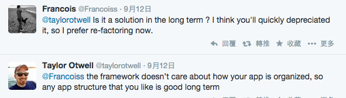

<!-- .slide: data-background="assets/img/upgrade.jpg" class="bg-inverse" data-transition="fade" -->

# 升級 <!-- .element: class="bar" -->

--<n>--

## [Upgrading To 5.0](http://laravel.com/docs/upgrade#upgrade-5.0)
### laravel.com > Dev > Upgrade Guide <!-- .element: style="text-align: center" -->

1. Update your `composer.json` dependency on `laravel/framework to 5.0.*` .

2. Run `composer update --no-scripts` .

3. Add the `Illuminate\Foundation\Providers\LegacyStructureServiceProvider` to your providers array in `app/config/app.php` file.

4. Remove the `Illuminate\Session\CommandsServiceProvider`, `Illuminate\Routing\ControllerServiceProvider`, and `Illuminate\Workbench\WorkbenchServiceProvider` entries from your providers array in the `app/config/app.php` file.

5. Add the following set of paths to the bottom of your bootstrap/paths.php file:

```php
'commands'    => __DIR__.'/../app/commands',
'config'      => __DIR__.'/../app/config',
'controllers' => __DIR__.'/../app/controllers',
'database'    => __DIR__.'/../app/database',
'filters'     => __DIR__.'/../app/filters',
'lang'        => __DIR__.'/../app/lang',
'providers'   => __DIR__.'/../app/providers',
'requests'    => __DIR__.'/../app/requests',
```

--<n>--

## Upgrading To 5.0

<!-- .element: style="width: 70%" -->

--<n>--

## Upgrading To 5.0

- [Update and use new structure](http://matthewhailwood.co.nz/upgrading-laravel-to-5-0/)
