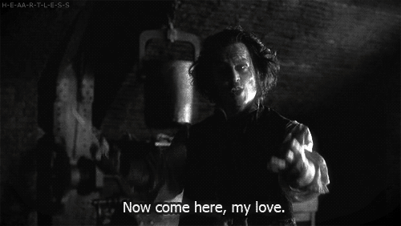

<!-- .slide: data-background="assets/img/band-cheering.jpg" class="bg-inverse" data-background-transition="cube" data-transition="fade" -->

## Laravel 5 新奇 有趣 又好玩

--<n>--

快加入 [Laravel 台灣](https://www.facebook.com/groups/laravel.tw/) <!-- .element: style="font-size: 2em" -->

 <!-- .element: style="width: 80%" -->

--<n>--

## 圖片來源 

- http://www.pexels.com/
- https://unsplash.com/
- http://wifflegif.com/
- http://www.reactiongifs.com/

--<n>--

## Links

- [Laracast](https://laracasts.com/series/whats-new-in-laravel-5/)
- [Mattstauffer's Blog](http://mattstauffer.co/blog/)
- [Upgrading To 5.0 From 4.2](http://laravel.com/docs/upgrade#upgrade-5.0)
- [Update and use new structure](http://matthewhailwood.co.nz/upgrading-laravel-to-5-0/)
- [GitHub : Illuminate/Foundation/Http/FormRequest.php](https://github.com/laravel/framework/blob/master/src/Illuminate/Foundation/Http/FormRequest.php)
- [GitHub : illuminate/contracts](https://github.com/illuminate/contracts)
- [Flysystem](http://flysystem.thephpleague.com/)
- [Laravel 台灣](https://www.facebook.com/groups/laravel.tw/)

--<n>--

## Thanks

 <!-- .element: style="width: 80%" -->
